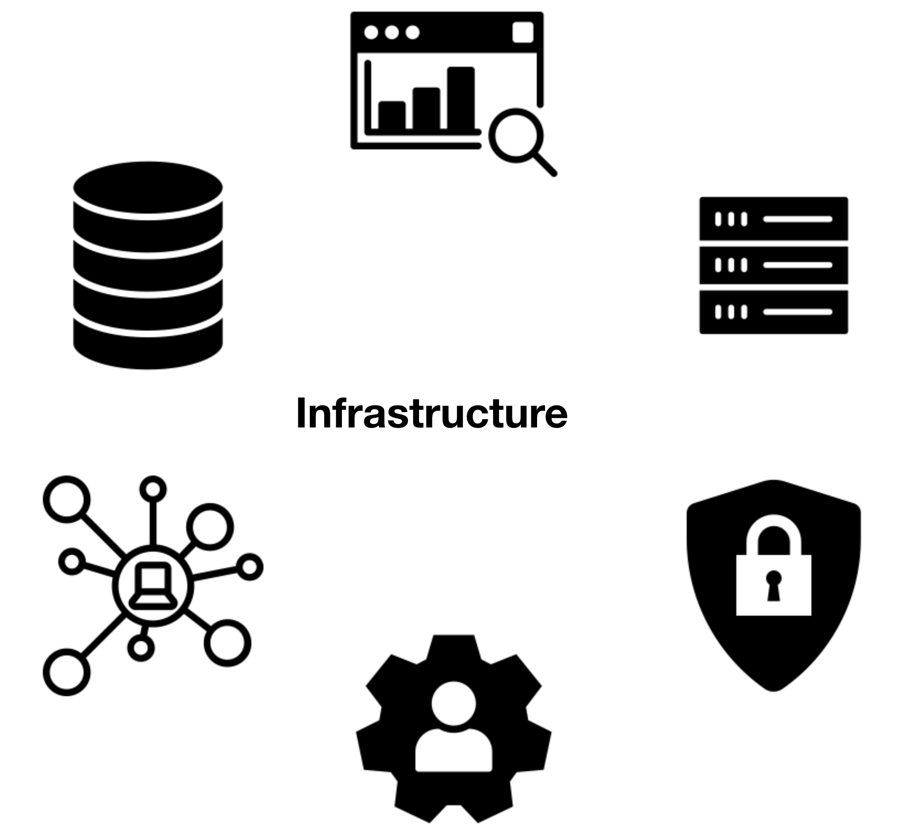
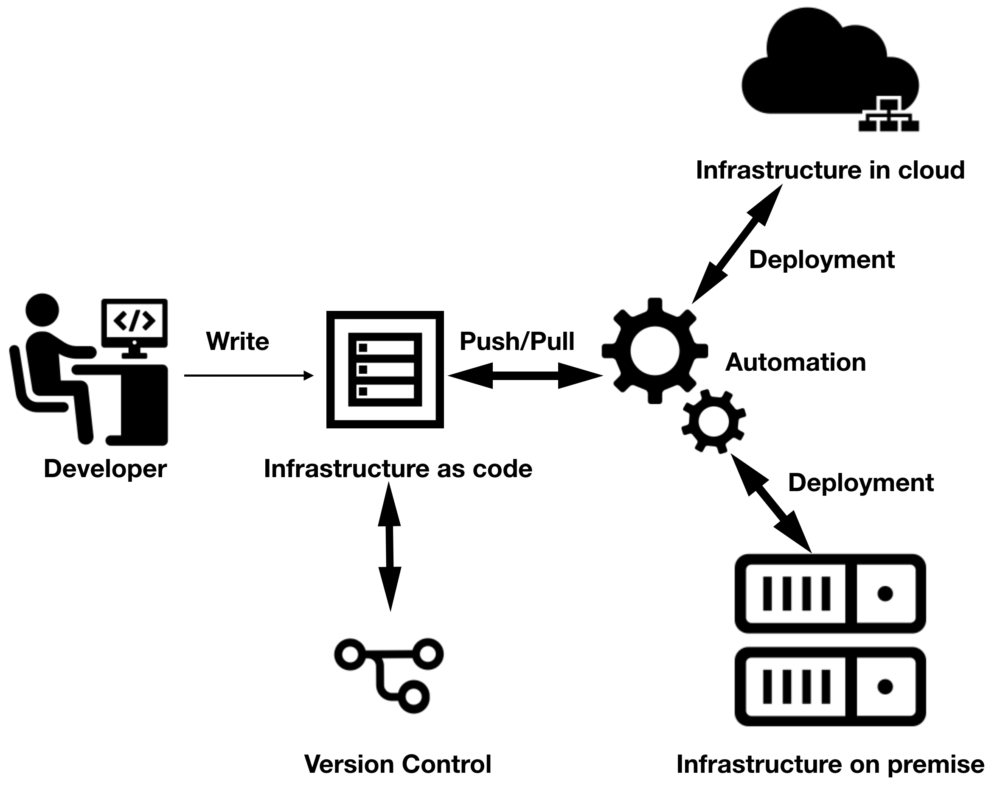

# Introduction

Here you will learn about IAC and its benefits.

## Infrastructure

What comes to mind when we hear "infrastructure"

But, for us IT people what comes -

- Storage
- Networking
- Security
- Servers
- Monitoring etc.

## Infrastructure as code

IaC is the managing, and provisioning of infrastructure through code instead of manual processes.

With IaC, configuration files are created that contain your infrastructure specifications, which makes it easier to edit and distribute configurations. It also ensures that you provision the same environment every time.

IaC is frequently referred to as Programmable Infrastructure.

## Types of approaches

There are generally two approaches to IaC:

### Declarative (What)

The declarative approach focuses on what the eventual target configuration should be.The declarative approach defines the desired state and the system executes what needs to happen to achieve that desired state.

### Imperative (How)

The imperative focuses on how the infrastructure is to be changed to meet this.Imperative defines specific commands that need to be executed in the appropriate order to end with the desired state.

## Pros of Infrastructure as Code

### Fast
IAC makes things faster as manual process of cofiguration is eliminated and through IAC developeers can create the infrastructure on their own instead of waiting for the IT Team to manual finish the task.

### Consistent
When we configure one resource using IAC and we have to configure similar resources the same code can be referred which will make consistent resources with no chances of missing out on configuration in case of manual process where chances of human error is higher.

### Scalable
With IAC same code can be used to create n number of resources but with manual process you have to configure those resources. 

### Reliable
It is reliable as in manual process you need to remember all those steps but here once the code is ready you can run it as many times as you want.

## Cons of Infrastructure as Code

### Learning Curve
Shifting from manual process to IAC would have a learning curve for developers as this would need some skills and learning about IAC tools. Some of the languages used for IaC are JSON, HashiCorp Configuration Languages (HCL), YAML, Ruby, etc.

### Configuration Drift
If a resource is created using IAC then manual intervention to the resource could lead to configuration drift.

### Error replication 
Since the initial code is developed by humans only so there is always a chance of minor error that could impact in long run. In this case if we used the same code for creating multiple resources then the same error would be replicated to all the resources.

## IAC Tools

Some of the IAC tools are Terraform, Chef, Puppet, CloudFormation, Ansible etc.

## Best Practices

1. For IAC to work correctly, your code should be your only point of contact i.e., for any infrastructure concerns you should rely on your code and configuration files.
2. Version control of configuration files.
3. Always test your configuration before deploying.
4. Use minimal or no documentation as code self documents the state.

